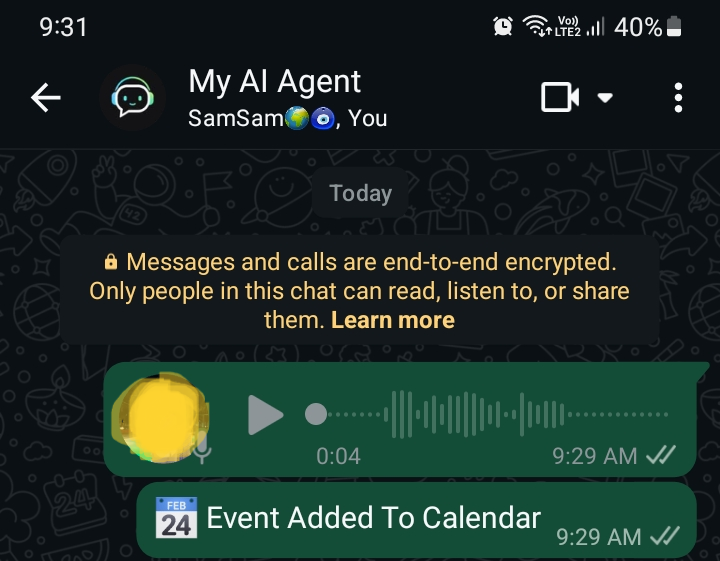
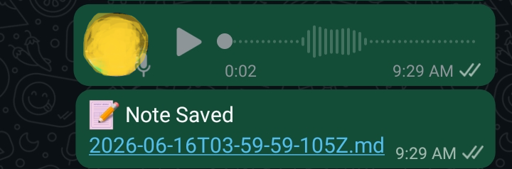
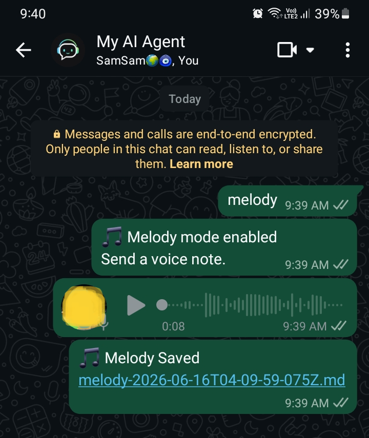

  

# WhatsApp AI Agent

Personal AI Assistant powered by:

- WhatsApp
- Ollama
- Gemma 3
- Obsidian
- Google Calendar
- Whisper

## Features

- Voice Notes → Calendar
- Voice Notes → Notes
- Voice Notes → AI Chat
- Melody Capture Mode
- Obsidian Integration
- Google Calendar Integration

## Setup

1. Install Node.js
2. Install Python
3. Install FFmpeg
4. Install Ollama
5. Run:
    bash
    setup.bat
6. Copy:
    text
    .env.example
to
    text
    .env

7. Fill in your settings

8. Add:
    text
    service-account.json
9. Run:
    bash
    start.bat

10. Scan WhatsApp QR

Done.

## Screenshots

### Voice → Calendar

### Voice → Notes

### Melody Capture

